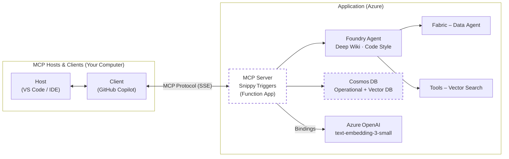

<!--
---
name: Snippy - Intelligent Code Snippet Service with MCP Tools
description: A serverless code snippet management service using Azure Functions, Durable Functions, Azure OpenAI, Microsoft Fabric and Azure AI Agents.
page_type: sample
languages:
- python
- bicep
- azdeveloper
products:
- azure-functions
- azure-durable-functions
- azure-openai
- azure-cosmos-db
- azure-ai-projects
- azure-ai-agents
- fabric
urlFragment: snippy
---
-->

<p align="center">
  <br>
  <b>Snippy · Intelligent Code-Snippet Service with MCP Tools</b>
</p>

[](https://github.com/codespaces/new?hide_repo_select=true&ref=main&repo=Azure-Samples/snippy&machine=basicLinux32gb&devcontainer_path=.devcontainer%2Fdevcontainer.json)
[](https://vscode.dev/redirect?url=vscode://ms-vscode-remote.remote-containers/cloneInVolume?url=https://github.com/Azure-Samples/snippy)

Snippy is an **Azure Functions**–based reference application that turns any function into an **MCP (Model Context Protocol) tool** consumable by GitHub Copilot Chat and other MCP‑aware clients. The sample implements a production‑style *code‑snippet service* with AI‑powered analysis:

* **Save snippets** – persists code, metadata and OpenAI embeddings in **Cosmos DB DiskANN**
* **Semantic retrieve** – vector search over embeddings
* **AI Agents** – generate a **deep wiki** or language‑specific **code style guide** from stored snippets
* **Durable fan‑out/fan‑in with Blueprints** – [in experimental branch](https://github.com/Azure-Samples/snippy/tree/gk/durable-functions) for large‑scale processing
* **Microsoft Fabric integration** – [in gk/fabric branch](https://github.com/Azure-Samples/snippy/tree/gk/fabric) demonstrating how to build Agents with Fabric Data Agents


The project ships with reproducible **azd** infrastructure, so `azd up` will stand up the entire stack – Functions, Cosmos DB, Azure OpenAI and Azure AI Agents – in a single command.

> **Important Security Notice**
> This repository is intended for learning and demonstration purposes. **Do not** deploy it to production without a thorough security review. At a minimum you should:
>
> * Swap connection strings for **Managed Identity** + **Azure Key Vault**
> * Restrict network access to Azure services via Private Endpoints or service‑tags
> * Enable GitHub secret‑scanning and CI security tools

[Features](#features) • [Architecture](#architecture-diagram) • [Getting Started](#getting-started) • [Guidance](#guidance)

---

## Features

* **Remote MCP trigger** – expose Functions as real‑time SSE tools
* **AI‑assisted documentation** – "deep‑wiki" and "code‑style" agents create rich Markdown (Mermaid, diagrams, etc.)
* **Vector search on Cosmos DB DiskANN** – low‑latency semantic retrieval
* **One‑click deploy** – `azd up` provisions and deploys code & infra
* **Codespaces & Dev Containers** – fully configured dev environment in your browser or local VS Code

### Tool Matrix

| Tool Name      | Purpose                                                             |
| -------------- | ------------------------------------------------------------------- |
| `save_snippet` | Save code snippets with vector embeddings for semantic search       |
| `get_snippet`  | Retrieve previously saved code snippets by their unique name        |
| `code_style`   | Generate language-specific code style guides from saved snippets    |
| `deep_wiki`    | Create comprehensive wiki documentation by analyzing code snippets  |

---

### Architecture Diagram




---

## Getting Started

You can run Snippy in **GitHub Codespaces**, **VS Code Dev Containers**, or your **local environment**. The fastest path is Codespaces.

> Snippy requires an Azure region that supports *text‑embedding‑3‑small* (or a compatible embeddings model) **and** Azure AI Agents. The `azd` workflow prompts you for a region; we recommend **eastus** for best availability.

### GitHub Codespaces

1. Click **Open in Codespaces** above (first badge) – the container build may take a few minutes.
2. When the terminal appears, sign in:

   ```bash
   azd auth login --use-device-code
   ```
3. Launch the stack:

   ```bash
   azd up
   ```
4. Once deployment completes, copy the printed MCP URL and open GitHub Copilot Chat → *Agent* mode to try commands like “Save this snippet as **hello‑world**”.

### VS Code Dev Containers

Prerequisites: [Docker Desktop](https://www.docker.com/products/docker-desktop) + the [Dev Containers](https://aka.ms/vscode/dev-containers) extension.

1. Click the **Dev Containers** badge (second badge) or run *Remote‑Containers: Open Repository in Container* from VS Code.
2. Sign in and launch as shown for Codespaces:

   ```bash
   azd auth login
   azd up
   ```

### Local Environment

#### Prerequisites

* [azd](https://aka.ms/install-azd) CLI
* Python 3.11 + [`uv`](https://github.com/astral-sh/uv)
* Node 18+ (for Functions Core Tools)
* Azure Functions Core Tools v4 (`npm i -g azure-functions-core-tools@4 --unsafe-perm`)

#### Quickstart

```bash
# 1. Clone & init
azd init --template Azure-Samples/snippy

# 2. Sign in
azd auth login

# 3. Provision & deploy
azd up
```

The CLI prints the Function App URL, MCP endpoint and system key when finished. To remove all resources later:

```bash
azd down --purge
```

---

## Guidance

### Region Availability

Azure OpenAI model support varies by region. Verify availability [here](https://learn.microsoft.com/azure/ai-services/openai/concepts/models#standard-deployment-model-availability) and choose the same region for all Azure resources. **eastus** and **swedencentral** are good default choices.

### Costs

Estimate monthly cost using the [Azure Pricing Calculator](https://azure.microsoft.com/pricing/calculator/). Major components:

* Azure Functions – Consumption / Flex tiers
* Cosmos DB – Serverless or provisioned throughput
* Azure OpenAI – pay‑as‑you‑go per 1K tokens
* Azure AI Agents – per‑execution billing (preview)

### Security

Snippy uses User-Assigned Managed Identity for secure service-to-service authentication. The infrastructure is configured with:

* **User-Assigned Managed Identity** on the Function App with appropriate RBAC roles:
  * Cosmos DB Data Contributor
  * Storage Blob Data Owner and Queue Data Contributor
  * Application Insights Monitoring Metrics Publisher
  * Azure AI Project Developer

For production deployments, we recommend:

* Restrict inbound traffic with Private Endpoints + VNet integration
* Enable network security features like service endpoints and firewall rules

---

## Resources

* Blog – *Build AI agent tools using Remote MCP with Azure Functions* ([https://aka.ms/snippy-blog](https://aka.ms/snippy-blog))
* Model Context Protocol spec – [https://aka.ms/mcp](https://aka.ms/mcp)
* Azure Functions Remote MCP docs – [https://aka.ms/azure-functions-mcp](https://aka.ms/azure-functions-mcp)
* Develop Python apps for Azure AI – [https://learn.microsoft.com/azure/developer/python/azure-ai-for-python-developers](https://learn.microsoft.com/azure/developer/python/azure-ai-for-python-developers)

---

## Contributing

Standard **fork → branch → PR** workflow. Use *Conventional Commits* (`feat:`, `fix:`) in commit messages.

---

## License

MIT © Microsoft Corporation
