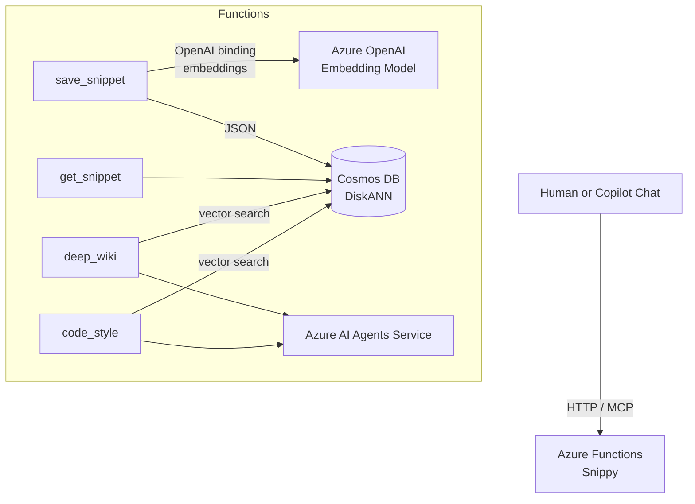

<!--
---
name: Snippy - Intelligent Code Snippet Service with MCP Tools
description: A serverless code snippet management service using Azure Functions, Durable Functions, Azure OpenAI, and Azure AI Agents.
page_type: sample
languages:
- python
- bicep
- azdeveloper
products:
- azure-functions
- azure-durable-functions
- azure-openai
- azure-cosmos-db
- azure-blob-storage
- azure-ai-agents
urlFragment: snippy
---
-->

<p align="center">
  <br>
  <b>Snippy · Intelligent Code-Snippet Service with MCP Tools</b>
</p>

# Snippy - Code Snippet Management Service

Snippy is a demo Azure Functions app that showcases the new **Model Context Protocol (MCP) trigger** - letting you expose any function as a tool that *GitHub Copilot Chat* and other MCP clients can invoke. The app demonstrates this by implementing a code snippet service with **save, search and AI-powered analysis tools** (using Azure AI Agents), storing snippets and their OpenAI embeddings in **Cosmos DB DiskANN** for semantic search.

*Durable Functions fan-out/fan-in workflows are under active development in the branch  
[`gk/durable-functions`](https://github.com/Azure-Samples/snippy/tree/gk/durable-functions).*

---

## ✨ Feature highlights

| Feature | How it works | Core tech | MCP tool |
| ------ | ------------ | --------- | -------- |
| **Save Snippet** | 1. Generates embeddings through the Functions ↔ OpenAI binding<br>2. Upserts document + vector to Cosmos DiskANN | Azure Functions, Azure OpenAI, Cosmos DB | `save_snippet` |
| **Get Snippet** | Reads a single document by id | Azure Functions, Cosmos DB | `get_snippet` |
| **Generate Wiki** | One vector search → Azure AI Agents → Markdown wiki with Mermaid diagrams | AI Agents, Cosmos DB vector search | `deep_wiki` |
| **Generate Style Guide** | Same pattern as wiki but outputs a language-specific guide | AI Agents, Cosmos DB vector search | `code_style` |
| **Remote MCP server** | The Functions runtime hosts `/runtime/webhooks/mcp/sse`, so Copilot (or any MCP client) can call the tools | Azure Functions | All of them |

---

### Why MCP?

[Model Context Protocol](https://aka.ms/mcp) is an open standard for advertising and calling custom LLM tools.  
With the **remote MCP trigger** in Azure Functions you get:

* *Zero* extra infrastructure – the Functions worker is the server.  
* Elastic scale on Flex Consumption.  
* Real-time streaming over Server-Sent Events.  
* First-class Azure auth (keys or Entra ID).

---

## High-level architecture



---

## Getting started (local)

### Prerequisites

| Tool | Notes |
| ---- | ----- |
| Python 3.11 | |
| [`uv`](https://github.com/astral-sh/uv) | fast virtual-env + installer |
| Azure Functions Core Tools v4 | `$ npm i -g azure-functions-core-tools@4 --unsafe-perm` |
| Azure CLI | `$ az login` |
| Azurite | local Storage emulator |
| Cosmos DB Emulator (Windows) *(or a real account)* | |
| VS Code Insiders + Copilot Chat *(optional)* | great for MCP testing |

### Setup

```bash
# 1. clone
$ git clone https://github.com/Azure-Samples/snippy.git
$ cd snippy/src

# 2. env
$ uv venv .venv && source .venv/bin/activate    # Windows: .venv\Scripts\activate

# 3. deps
$ uv pip install -r requirements.txt

# 4. secrets
$ cp local.settings.example.json ../local.settings.json
# edit the file with:
#   - COSMOS_CONN (or leave blank for Linux emulator)
#   - AZURE_OPENAI_ENDPOINT + AZURE_OPENAI_KEY
#   - PROJECT_CONNECTION_STRING (AI Agents)
```

Start Azurite and the Cosmos emulator (or point to real services) then:

```bash
$ func start
```

The app listens on `http://localhost:7071`.

---

## Configure MCP clients

### Quick `mcp.json`

```bash
$ mkdir -p .vscode && cat > .vscode/mcp.json <<'EOF'
{
  "inputs": [
    {
      "type": "promptString",
      "id": "functions-mcp-extension-system-key",
      "description": "Azure Functions MCP system key",
      "password": true
    },
    {
      "type": "promptString",
      "id": "functionapp-name",
      "description": "Deployed Function App name"
    }
  ],
  "servers": {
    "local-snippy": {
      "type": "sse",
      "url": "http://localhost:7071/runtime/webhooks/mcp/sse"
    },
    "remote-snippy": {
      "type": "sse",
      "url": "https://${input:functionapp-name}.azurewebsites.net/runtime/webhooks/mcp/sse",
      "headers": { "x-functions-key": "${input:functions-mcp-extension-system-key}" }
    }
  }
}
EOF
```

Grab the *system key* with

```bash
$ az functionapp keys list -g <rg> -n <func> --query "systemKeys.mcp_extension" -o tsv
```

### Chat naturally in Copilot

Open Copilot Chat → **Agent** mode and try phrases like:

* "Save this code as **test-snippet**" (first select some code)  
* “Show me **test-snippet**”  
* “Create a project wiki”  
* “Generate a style guide from the stored snippets”

GitHub Copilot will discover and invoke the correct MCP tool automatically.

For a GUI explorer, use MCP Inspector:

```bash
$ npx @modelcontextprotocol/inspector http://localhost:7071/runtime/webhooks/mcp/sse
```

---

## Codespaces - one click, full stack

<p align="center">
  <a href="https://github.com/codespaces/new?hide_repo_select=true&ref=main&repo=Azure-Samples/snippy&machine=basicLinux32gb&devcontainer_path=.devcontainer%2Fdevcontainer.json">
    
  </a>
</p>

1. Click **Open in Codespaces**.  
2. Provide these secrets when prompted:

   * `AzureWebJobsStorage`  
   * `COSMOS_CONN`  
   * `AZURE_OPENAI_ENDPOINT`  
   * `AZURE_OPENAI_KEY`  
   * `PROJECT_CONNECTION_STRING`

3. Wait for the container to build; the terminal finishes with `func start` already running.  
4. Test any endpoint from the **Ports** tab.

---

## One-click Azure deploy (AZD)

```bash
$ winget install Microsoft.Azure.DeveloperCLI      # or curl https://aka.ms/install-azd.sh | bash
$ azd auth login
$ azd up                                           # creates RG, Functions, Cosmos, OpenAI, AI Agents, App Insights
```

The CLI prints the remote MCP SSE URL and function key when it finishes.

---

## REST endpoints

```http
POST /api/snippets              – save a snippet
GET  /api/snippets/{name}       – fetch one
POST /api/snippets/wiki         – generate wiki
POST /api/snippets/code-style   – generate style guide
```

---

## Cleanup

```bash
# local
Ctrl-C (stop Functions) ; deactivate ; rm -rf .venv local.settings.json

# azd deployment
$ azd down --purge
```

---

## Contributing

Standard fork → branch → PR workflow. Use **Conventional Commits** (`feat: …`, `fix: …`) in your messages.

---

## License

MIT © Microsoft Corporation