<p align="center">
  <br>
  <b>Snippy · Intelligent Code-Snippet Service</b>
</p>

<p align="center">
  <a href="https://github.com/Azure-Samples/snippy/actions">
    </a>
  <a href="LICENSE">
    </a>
</p>

> 🧩 **Snippy** is a serverless, AI-powered playground built to **show-off the new ✨ Model Context Protocol (MCP) tools in Azure Functions** (Python v2).  
> It stores, analyses & beautifies your snippets, then exposes those capabilities as **MCP tools that GitHub Copilot (or any LLM agent/MCP Host) can invoke on demand**.

---

## ✨ Feature Highlights

| 🚀  | What it does | How MCP helps |
|----|--------------|---------------|
| 📦 | **Smart Storage** – snippets land in Blob Storage & Cosmos DB with vector index | `saveSnippet` / `getSnippet` MCP tools |
| 🔬 | **Deep Research** – AI Agents service explains algorithms & suggests improvements | `deepResearch` MCP tool |
| 🎨 | **Style Guides** – autogenerates language-specific style guides | `createStyleGuide` MCP tool |
| 🧠 | **Semantic Search** – cosine similarity over embeddings in Cosmos DB | transparent to tools |
| 🔄 | **Durable Workflows** – fan-out / fan-in orchestrations glue everything | orchestrations run *inside* tools |
| 🛠 | **Remote MCP Server** – Functions hosts tool trigger + SSE endpoint (`/runtime/webhooks/mcp/sse`) | makes tools discoverable in VS Code & GitHub Copilot |

---

## 🌐 Why MCP?

[Model Context Protocol](https://aka.ms/mcp) lets your app *advertise* and *execute* tools for an LLM.  
The **remote MCP trigger** in Functions (see the [announcement blog](https://techcommunity.microsoft.com/blog/appsonazureblog/build-ai-agent-tools-using-remote-mcp-with-azure-functions/4401059)) means:

* no extra infra – just `func start` and you already have an MCP server,
* automatic scale (Flex Consumption!) when Copilot calls your tools,
* **SSE streaming** so Copilot sees live progress from Functions,
* first-class key/identity security baked in.

Snippy uses those triggers to surface its snippet-centric super-powers straight into **GitHub Copilot Chat**.

---

## 🏗️ Architecture

```mermaid
flowchart LR
  subgraph "MCP Tools @ Azure Functions"
    Save(SaveSnippet 🔧):::tool
    Get(GetSnippet 🔧):::tool
    Research(DeepResearch 🔧):::tool
    Style(StyleGuide 🔧):::tool
  end
  classDef tool fill:#4F46E5,color:#fff,stroke:#4F46E5

  Save & Get & Research & Style -->|fan-out / fan-in| Orch[(Durable Orchestrator)]
  Orch --> B[(Blob Storage)]
  Orch --> C[(Cosmos DB • Vectors)]
  Orch --> OA(OpenAI Embeddings)
  Orch --> Agents(AI Agents Service)
```



---

## ⚙️ Quick Start (local)

> Prereqs · **Python 3.11** · Azure CLI · **Functions Core Tools v4** · Azurite · Cosmos Emulator

```bash
git clone https://github.com/Azure-Samples/snippy.git && cd snippy
python -m venv .venv && source .venv/bin/activate      # Win: .venv\Scripts\activate
pip install -r requirements.txt

cp local.settings.example.json local.settings.json     # add your keys

azurite --silent &                                     # storage emulator
"C:\Program Files\Azure Cosmos DB Emulator\Microsoft.Azure.Cosmos.Emulator.exe" &

func start                                             # http://localhost:7071 &
```

### 🔌 Hook it into VS Code / Copilot

1. Install **VS Code Insiders** (latest) & enable the MCP preview.  
2. `⇧⌘P → “MCP: Add Server” → HTTP (SSE)`  
   paste **`http://localhost:7071/runtime/webhooks/mcp/sse`**.  
3. Open *Copilot Chat → Agent mode* and try:  
   > “Save the selected code as a snippet called **hello-world**.” 
   Watch the breakpoint in `saveSnippet` fire! 🔥

*(When you deploy, swap the URL + add your `x-functions-key` in `mcp.json`.)*

---

## ☁️ One-Click Azure Deploy

```bash
winget install Microsoft.Azure.DeveloperCLI
azd auth login
azd up            # Functions + Storage + Cosmos + OpenAI + App Insights
```

---

## 🧪 Tests

```bash
pytest -q         # all Azure clients mocked ⇒ offline-friendly
```

---

## 📁 Project Layout

```
snippy/
├── activities/        # blob & cosmos ops (async)
├── agents/            # wrappers for Azure AI Agents service
├── orchestrators.py   # durable fan-out / fan-in blueprint
├── function_app.py    # HTTP + MCP tool triggers
└── tests/             # pytest suite
```

---

## 🤝 Contributing

1. `fork → git switch -c feat/my-amazing-idea`  
2. commit with **Conventional Commits** (`feat: …`)  
3. `git push` & open a PR – our templates + CI will guide you 💜

---

## 📜 License

MIT – hack away!

---