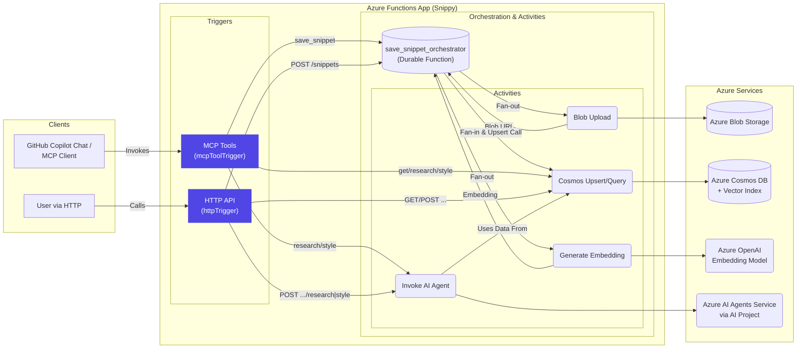

<!--
---
name: Snippy - Intelligent Code Snippet Service with MCP Tools
description: A serverless code snippet management service using Azure Functions, Durable Functions, Azure OpenAI, and Azure AI Agents.
page_type: sample
languages:
- python
- bicep
- azdeveloper
products:
- azure-functions
- azure-durable-functions
- azure-openai
- azure-cosmos-db
- azure-blob-storage
- azure-ai-agents
urlFragment: snippy
---
-->

<p align="center">
  <br>
  <b>Snippy · Intelligent Code-Snippet Service with MCP Tools</b>
</p>

# Snippy - Code Snippet Management Service

Snippy is a Python-based service for managing and sharing code snippets. It provides a simple API for creating, retrieving, and managing code snippets with support for multiple programming languages.

## Features

- Create and manage code snippets
- Support for multiple programming languages
- Simple REST API
- Azure Functions-based architecture
- Easy deployment and scaling

## Architecture

Snippy is built on Azure Functions and uses a serverless architecture. The service consists of:

- HTTP-triggered functions for API endpoints
- Blob storage for snippet content
- Cosmos DB for metadata storage
- Azure Key Vault for secrets management

## API Endpoints

### Create Snippet
```http
POST /api/snippets
Content-Type: application/json

{
    "title": "My Code Snippet",
    "description": "A useful code example",
    "language": "python",
    "code": "print('Hello, World!')",
    "tags": ["example", "python"]
}
```

### Get Snippet
```http
GET /api/snippets/{id}
```

### List Snippets
```http
GET /api/snippets
```

### Update Snippet
```http
PUT /api/snippets/{id}
Content-Type: application/json

{
    "title": "Updated Title",
    "description": "Updated description",
    "code": "print('Updated code')"
}
```

### Delete Snippet
```http
DELETE /api/snippets/{id}
```

## Development

### Prerequisites

- Python 3.8+
- Azure Functions Core Tools
- Azure CLI
- Azure subscription

### Local Development

1. Clone the repository
2. Create a virtual environment:
   ```bash
   python -m venv .venv
   source .venv/bin/activate  # On Windows: .venv\Scripts\activate
   ```
3. Install dependencies:
   ```bash
   pip install -r requirements.txt
   ```
4. Set up local settings:
   ```bash
   cp local.settings.json.example local.settings.json
   ```
5. Update `local.settings.json` with your Azure credentials
6. Run the function app locally:
   ```bash
   func start
   ```

### Testing

Run the test suite:
```bash
pytest
```

## Deployment

### Azure Functions Deployment

1. Create a resource group:
   ```bash
   az group create --name my-resource-group --location eastus
   ```

2. Create a storage account:
   ```bash
   az storage account create --name mystorageaccount --location eastus --resource-group my-resource-group --sku Standard_LRS
   ```

3. Create a function app:
   ```bash
   az functionapp create --resource-group my-resource-group --consumption-plan-location eastus --runtime python --runtime-version 3.8 --functions-version 3 --name my-function-app --storage-account mystorageaccount
   ```

4. Deploy the function app:
   ```bash
   func azure functionapp publish my-function-app
   ```

## Contributing

1. Fork the repository
2. Create a feature branch
3. Commit your changes
4. Push to the branch
5. Create a Pull Request

## License

This project is licensed under the MIT License - see the LICENSE file for details.

<p align="center">
  <a href="https://codespaces.new/Azure-Samples/snippy"> </a>
</p>

---

## ✨ Feature Highlights

Snippy provides both standard HTTP endpoints and MCP Tools for interacting with code snippets:

| Feature | How it Works | Core Technologies | MCP Tool(s) |
|---|---|---|---|
| 📦 **Save Snippet** | HTTP/MCP trigger initiates a Durable Function orchestrator. | *Fan-out:* Uploads raw code to **Blob Storage** & generates embeddings via **Azure OpenAI**. <br> *Fan-in:* Upserts snippet metadata + vector embedding into **Cosmos DB**. | `save_snippet` |
| 🔍 **Get Snippet** | HTTP/MCP trigger directly fetches snippet data (including code, metadata) from **Cosmos DB**. | Azure Functions, Cosmos DB | `get_snippet` |
| 🔬 **Deep Research** | HTTP/MCP trigger fetches snippet & similar snippets (via vector search) from **Cosmos DB**, then uses **Azure AI Agents** service to generate a detailed analysis. | Azure Functions, Cosmos DB (Vector Search), Azure AI Agents | `deep_research` |
| 🎨 **Style Guide Generation** | HTTP/MCP trigger fetches snippet & similar snippets from **Cosmos DB**, then uses **Azure AI Agents** service to generate a language-specific code style guide. | Azure Functions, Cosmos DB (Vector Search), Azure AI Agents | `code_style` |
| 🧠 **Semantic Search** | **Cosmos DB's integrated vector database** capabilities enable finding snippets based on semantic similarity (used by Research & Style Guide features). | Cosmos DB | *(Internal)* |
| 🔄 **Durable Workflows** | Complex operations like saving snippets leverage **Durable Functions** orchestrators for reliable, parallel execution of activities. | Azure Durable Functions | *(Internal)* |
| 🛠 **Remote MCP Server** | Azure Functions hosts the `mcpToolTrigger` and the required SSE endpoint (`/runtime/webhooks/mcp/sse`), making tools discoverable and invokable by MCP clients like **GitHub Copilot Chat**. | Azure Functions (MCP Trigger) | *(All)* |

---

## 🌐 Why MCP?

[Model Context Protocol (MCP)](https://aka.ms/mcp) allows applications to advertise and execute custom tools for Large Language Models (LLMs). The **remote MCP trigger** in Azure Functions (see the [announcement blog](https://techcommunity.microsoft.com/t5/apps-on-azure-blog/build-ai-agent-tools-using-remote-mcp-with-azure-functions/ba-p/4113709)) provides significant advantages:

* **Simplified Infrastructure:** No need for a separate MCP server; `func start` includes it.
* **Scalability:** Leverage Azure Functions scaling (including Flex Consumption) when Copilot calls your tools.
* **Real-time Updates:** Server-Sent Events (SSE) streaming allows Copilot to display live progress from Functions.
* **Built-in Security:** Utilize standard Azure Functions authentication (keys, identity).

Snippy surfaces all snippet operations through this trigger so GitHub Copilot and any MCP‑aware client can call them.

---

## 🏗️ Architecture




## ⚙️ Getting Started (Local Development)

### Prerequisites

  * **Python 3.11**
  * **uv** (Install via `pip install uv` or see [official guide](https://github.com/astral-sh/uv))
  * **Azure Functions Core Tools v4** (`npm install -g azure-functions-core-tools@4 --unsafe-perm true` or see [official guide](https://docs.microsoft.com/azure/azure-functions/functions-run-local))
  * **Azure CLI** (`az login`)
  * **Azurite** Storage Emulator (Install via VS Code extension, npm, or [standalone](https://docs.microsoft.com/azure/storage/common/storage-use-azurite))
  * **Azure Cosmos DB Emulator** ([Windows only](https://docs.microsoft.com/azure/cosmos-db/local-emulator)) or a real Cosmos DB account.
  * **(Optional but Recommended):** VS Code Insiders with GitHub Copilot Chat extension for testing MCP tools.

### Setup & Run

1.  **Clone the repository:**

    ```bash
    git clone https://github.com/Azure-Samples/snippy.git
    cd snippy/src
    ```

2.  **Create and activate a virtual environment:**

    ```bash
    # Using uv
    uv venv .venv
    # Windows:
    .venv\Scripts\activate
    # macOS/Linux:
    # source .venv/bin/activate
    ```

3.  **Install dependencies:**

    ```bash
    # Using uv
    uv pip install -r requirements.txt
    ```

4.  **Configure local settings:**

      * Copy the example settings file:
        ```bash
        cp local.settings.example.json local.settings.json
        ```
      * **Edit `local.settings.json`**:
          * `AzureWebJobsStorage`: Update with your Azurite connection string (usually `UseDevelopmentStorage=true`) or a real Azure Storage connection string.
          * `COSMOS_CONN`: Update with your Cosmos DB Emulator connection string (find in system tray icon after starting) or a real Cosmos DB connection string.
          * `AZURE_OPENAI_ENDPOINT`, `AZURE_OPENAI_KEY`, `EMBEDDING_MODEL_DEPLOYMENT_NAME`: **Required**. Provide details for your Azure OpenAI resource and the deployment name of an embedding model (e.g., `text-embedding-3-small`). *There is no local emulator for Azure OpenAI.*
          * `PROJECT_CONNECTION_STRING`: **Required**. Provide the connection string for your Azure AI Project where the AI Agents service is configured. *There is no local emulator for Azure AI Agents.*

5.  **Start Emulators / Ensure Services Ready:**

      * Start Azurite (e.g., via VS Code command palette `Azurite: Start`).
      * Start the Azure Cosmos DB Emulator (if using).
      * Ensure your Azure OpenAI and Azure AI Project resources are deployed and accessible. You might need to configure networking if running locally.

6.  **Run the Azure Functions Host:**

    ```bash
    func start
    ```

    Your Functions app should now be running locally, typically at `http://localhost:7071`.

-----

## 🔌 Configure MCP Clients

### 1. Quick mcp.json template

Put the file below at **.vscode/mcp.json** (Codespaces already has the folder). The inputs prompt once, then VS Code stores them in its secrets store.

```json
{
  "inputs": [
    {
      "type": "promptString",
      "id": "functions-mcp-extension-system-key",
      "description": "Azure Functions MCP Extension System Key",
      "password": true
    },
    {
      "type": "promptString",
      "id": "functionapp-name",
      "description": "Azure Functions App Name"
    }
  ],
  "servers": {
    "remote-snippy": {
      "type": "sse",
      "url": "https://${input:functionapp-name}.azurewebsites.net/runtime/webhooks/mcp/sse",
      "headers": {
        "x-functions-key": "${input:functions-mcp-extension-system-key}"
      }
    },
    "local-snippy": {
      "type": "sse",
      "url": "http://localhost:7071/runtime/webhooks/mcp/sse"
    }
  }
}
```

> • Grab the **system key** (`mcp_extension`) from the portal or CLI:  
> `az functionapp keys list --resource-group <rg> --name <func>`

### 2. Add the server in VS Code / Copilot

1. Open the Command Palette → **MCP: Add Server** (if you skipped the json).
2. Choose **HTTP (SSE)** and paste either the local or remote SSE endpoint.
3. Switch Copilot to *Agent* mode and call the tools:
   ```text
   @workspace /#save_snippet Save selection as 'demo-snippet'
   @workspace /#get_snippet Show 'demo-snippet'
   ```

### 3. MCP Inspector (optional)

The free [MCP Inspector](https://www.npmjs.com/package/@modelcontextprotocol/inspector) lets you list and invoke tools from any MCP server.

```bash
npx @modelcontextprotocol/inspector
```
Connect using the same SSE URL – append `?code=<systemKey>` when you test the remote app.

-----

## 💻 One‑Click Codespaces

> **Fastest path** – try Snippy in the browser without installing anything.
<p align="center">
  <a href="https://codespaces.new/Azure-Samples/snippy"> </a>
</p>

1. Click the **Open in GitHub Codespaces** badge above.
2. Wait for the dev container to build (1‑2 minutes).
3. Terminal window appears with `func start` already running via the `postCreate` script.
4. The MCP extension in VS Code Web auto‑detects `local-snippy` from `.vscode/mcp.json` – accept the prompt to start the server.

-----

## ☁️ One-Click Azure Deployment (using AZD)

The Azure Developer CLI (`azd`) provides the simplest way to provision all required Azure resources and deploy the code.

1.  **Install or Update AZD:**
    ```bash
    winget install Microsoft.Azure.DeveloperCLI
    # or: curl -fsSL https://aka.ms/install-azd.sh | bash
    ```
2.  **Login to Azure:**
    ```bash
    azd auth login
    ```
3.  **Provision and Deploy:**
    ```bash
    azd up
    ```
    This command will:
      * Prompt you for an environment name, subscription, and location.
      * Provision Azure Functions, Storage, Cosmos DB (with vector policy), Azure OpenAI, and Application Insights using Bicep templates (`infra/`).
      * Deploy the function app code.
      * Output the necessary endpoints, including the MCP SSE endpoint for your deployed app.

-----

## 🧪 Tests

Run the automated tests using pytest. These tests mock Azure service calls and are suitable for offline execution.

```bash
pytest -q
```

-----

## 📁 Project Layout

```plaintext
snippy/
├── .github/           # GitHub Actions workflows, issue templates, etc.
├── data/              # Data access layer (Cosmos DB operations)
│   └── cosmos_ops.py
├── agents/            # Wrappers for Azure AI Agents service calls
│   ├── code_style.py
│   └── deep_research.py
├── infra/             # (If using AZD) Bicep/Terraform templates for Azure resources
├── tests/             # Pytest unit/integration tests
├── .gitignore
├── azure.yaml         # (If using AZD) Azure Developer CLI configuration
├── CHANGELOG.md
├── CONTRIBUTING.md
├── function_app.py    # Main Azure Functions definitions (HTTP + MCP triggers)
├── host.json          # Functions host configuration (bundles, logging)
├── LICENSE.md
├── local.settings.json # Local development secrets (DO NOT COMMIT)
├── orchestrators.py   # Durable Function orchestrator definitions (blueprint)
├── README.md          # This file
└── requirements.txt   # Python package dependencies
```

-----

## 🤝 Contributing

Contributions are welcome\! Please follow standard fork-and-pull-request workflow.

1.  Fork the repository.
2.  Create a new branch (`git switch -c feat/your-feature`).
3.  Make your changes.
4.  Commit your changes using **Conventional Commits** (`feat: ...`, `fix: ...`, etc.).
5.  Push to your branch (`git push origin feat/your-feature`).
6.  Open a Pull Request against the `main` branch.

-----

## 📜 License

This project is licensed under the [MIT License](LICENSE.md).

