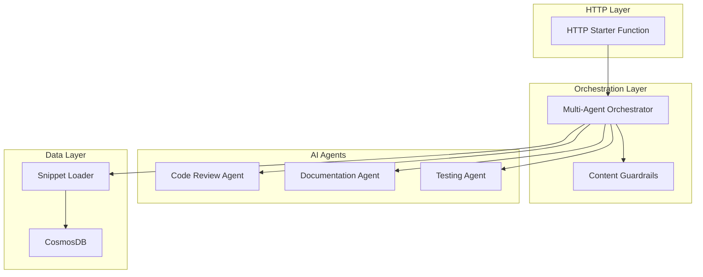

# Deep Wiki: Multi-Agent Orchestration & CosmosDB Deployment

## Executive Summary

This deep wiki provides comprehensive documentation for implementing multi-agent AI orchestration systems with Azure Durable Functions and CosmosDB data persistence. The architecture leverages Azure AI agents for code review, documentation generation, and test creation, orchestrated through a robust workflow engine with built-in content filtering and error handling.

## Table of Contents

1. [Architecture Overview](#architecture-overview)
2. [Core Components](#core-components)
3. [Multi-Agent Orchestration Patterns](#multi-agent-orchestration-patterns)
4. [CosmosDB Integration](#cosmosdb-integration)
5. [AI Agent Implementation](#ai-agent-implementation)
6. [Security & Content Filtering](#security--content-filtering)
7. [Deployment Guide](#deployment-guide)
8. [Code Examples](#code-examples)
9. [Best Practices](#best-practices)
10. [Troubleshooting](#troubleshooting)

## Architecture Overview

### System Components



### Technology Stack

- **Runtime**: Azure Functions Python v2 (Blueprint Model)
- **Orchestration**: Azure Durable Functions
- **AI Platform**: Azure AI Project Client
- **Database**: Azure CosmosDB (SQL API)
- **Authentication**: Azure Default Credential
- **Content Filtering**: Custom guardrails with token limits

## Core Components

### 1. Multi-Agent Orchestrator Pattern

**Source**: `durable-orchestrator-pattern`

The orchestrator coordinates multiple AI agents in a structured workflow:

```python
@bp.orchestration_trigger(context_name="context")
def multi_agent_orchestrator(context: df.DurableOrchestrationContext) -> Generator[Any, Any, dict]:
    """Coordinate agents to review a snippet, then write docs and tests."""
    payload: dict = context.get_input() or {}
    project_id: str = payload.get("projectId", "default-project")
    snippet_id: str = payload.get("snippetId", payload.get("name", ""))
    workflow: str = payload.get("workflow", "code-review-and-docs")

    corr = context.instance_id
    logging.info("L5 ORCH start id=%s project=%s snippet=%s wf=%s", corr, project_id, snippet_id, workflow)

    if not snippet_id:
        return {"ok": False, "error": "snippetId is required", "correlationId": corr}

    # Phase 0: Load snippet (I/O in activity)
    snippet: dict = yield context.call_activity("load_snippet_activity", {"name": snippet_id})
    code_text: str = (snippet or {}).get("code", "")

    # Phase 1: Code review (sequential)
    review: dict = yield context.call_activity(
        "code_review_agent_activity",
        {"code": code_text, "projectId": project_id, "correlationId": corr},
    )

    # Phase 2: Fan-out docs + tests (dependent on review)
    tasks = [
        context.call_activity(
            "documentation_agent_activity",
            {"code": code_text, "review": review, "projectId": project_id, "correlationId": corr},
        ),
        context.call_activity(
            "testing_agent_activity",
            {"code": code_text, "review": review, "projectId": project_id, "correlationId": corr},
        ),
    ]
    docs_result, tests_result = yield context.task_all(tasks)

    result: dict = {
        "ok": True,
        "correlationId": corr,
        "agents": {
            "review": review,
            "documentation": docs_result,
            "testing": tests_result,
        },
    }

    logging.info("L5 ORCH done id=%s", corr)
    return result
```

**Key Features**:
- **Phase-based execution**: Sequential loading → review → parallel docs/tests
- **Fan-out/Fan-in pattern**: Parallel execution with `context.task_all()`
- **Correlation tracking**: Unique instance IDs for request tracing
- **Error handling**: Graceful failures with structured error responses

### 2. Content Filtering & Guardrails

**Source**: `content-filter-guardrails`

Implements security and resource management controls:

```python
def _apply_guardrails(code: str, *, token_limit: int = AGENT_TOKEN_LIMIT, enable_filter: bool = ENABLE_CONTENT_FILTER) -> tuple[str, list[str]]:
    """Apply simple guardrails: truncate to token budget and basic content screen."""
    issues: list[str] = []

    # Approx token:chars 1:4 heuristic to keep deterministic in orch
    max_chars = max(256, token_limit * 4)
    if len(code) > max_chars:
        issues.append(f"truncated:{len(code)}->{max_chars}")
        code = code[:max_chars]

    if enable_filter:
        banned = ["DROP TABLE", "rm -rf", "BEGIN RSA PRIVATE KEY", "AKIA"]
        found = [w for w in banned if w.lower() in code.lower()]
        if found:
            issues.append("content-filter:blocked")
            # Redact risky fragments
            for w in found:
                code = code.replace(w, "[REDACTED]")

    return code, issues
```

**Security Controls**:
- **Token budget enforcement**: Prevents resource exhaustion
- **Content screening**: Blocks dangerous patterns (SQL injection, secrets, destructive commands)
- **Deterministic truncation**: Maintains consistent behavior in orchestration
- **Issue tracking**: Reports all applied filters for audit trails

### 3. HTTP Starter Function

**Source**: `durable-functions-http-starter`

Provides REST API entry point for orchestration:

```python
@bp.route(route="orchestrators/multi-agent-review", methods=["POST"], auth_level=func.AuthLevel.FUNCTION)
@bp.durable_client_input(client_name="client")
async def http_start_multi_agent(req: func.HttpRequest, client: df.DurableOrchestrationClient) -> func.HttpResponse:
    """HTTP starter for multi-agent orchestrator."""
    try:
        body = req.get_json()
        fn = "multi_agent_orchestrator"
        instance_id = await client.start_new(orchestration_function_name=fn, instance_id=None, client_input=body)
        logging.info("Started L5 orchestration id=%s", instance_id)
        return client.create_check_status_response(req, instance_id)
    except Exception as e:
        logging.error("HTTP starter L5 error: %s", e, exc_info=True)
        return func.HttpResponse(body=json.dumps({"error": str(e)}), mimetype="application/json", status_code=500)
```

**REST API Features**:
- **Standard HTTP interface**: POST endpoint with JSON payload
- **Azure Functions integration**: Function-level authentication
- **Status tracking**: Built-in status endpoints for monitoring
- **Error handling**: Structured error responses with proper HTTP codes

## CosmosDB Integration

### 1. Infrastructure Deployment

**Source**: `cosmos-db-container-bicep`

Azure Bicep template for CosmosDB setup:

```bicep
// Cosmos DB Database
resource cosmosDatabase 'Microsoft.DocumentDB/databaseAccounts/sqlDatabases@2025-04-15' = {
  parent: cosmosAccount
  name: 'dev-snippet-db'
  properties: {
    resource: {
      id: 'dev-snippet-db'
    }
  }
}

// Cosmos DB Container with basic indexing (vector policy will be configured via code)
resource cosmosContainer 'Microsoft.DocumentDB/databaseAccounts/sqlDatabases/containers@2025-04-15' = {
  parent: cosmosDatabase
  name: 'code-snippets'
  properties: {
    resource: {
      id: 'code-snippets'
      partitionKey: {
        paths: ['/name']
        kind: 'Hash'
      }
      indexingPolicy: {
        indexingMode: 'consistent'
        automatic: true
        includedPaths: [
          {
            path: '/*'
          }
        ]
        excludedPaths: [
          {
            path: '/embedding/*'
          }
        ]
      }
    }
  }
}
```

**Infrastructure Features**:
- **Partition strategy**: Hash partitioning on `/name` field
- **Optimized indexing**: Excludes vector embeddings from indexing for performance
- **Consistent reads**: Ensures data consistency across replicas
- **Vector search ready**: Prepared for AI/ML embedding operations

### 2. Data Access Layer

**Source**: `durable-activity-cosmos-loader`

Asynchronous data loading activity:

```python
@bp.activity_trigger(input_name="snippet")
async def load_snippet_activity(snippet: dict) -> dict:
    """Load a snippet by id from Cosmos (async)."""
    if not isinstance(snippet, dict):
        try:
            snippet = json.loads(snippet) if snippet else {}
        except (json.JSONDecodeError, TypeError):
            snippet = {}
    
    name: str = snippet.get("name", "")
    if not name:
        return {}
    try:
        doc = await cosmos_ops.get_snippet_by_id(name)
        return doc or {}
    except Exception as e:
        logging.error("load_snippet failed: %s", e, exc_info=True)
        return {}
```

**Data Access Features**:
- **Type safety**: Input validation and type conversion
- **Error resilience**: Graceful failure handling
- **Async operations**: Non-blocking I/O for better performance
- **Logging integration**: Comprehensive error tracking

## AI Agent Implementation

### 1. Code Review Agent

**Source**: `azure-ai-code-review-agent`

Analyzes code for security, performance, and quality issues:

```python
@bp.activity_trigger(input_name="codeData")
async def code_review_agent_activity(codeData: dict) -> dict:
    """Analyze code for issues using Azure AI agent; return structured findings (async)."""
    # ... input validation ...
    
    try:
        system_prompt = """
You are a CodeReviewAgent, an expert code analyzer that identifies issues and provides feedback.

Analyze the provided code for:
1. Security vulnerabilities (SQL injection, XSS, code injection, etc.)
2. Performance issues (inefficient algorithms, memory leaks, etc.)
3. Code quality problems (poor naming, missing documentation, etc.)
4. Best practices violations (error handling, logging, etc.)
5. Potential bugs and logic errors

Return your analysis as a JSON object with this structure:
{
    "summary": "Brief overview of the code review",
    "issues": [
        {
            "type": "security|performance|quality|bug|style",
            "severity": "high|medium|low",
            "line": line_number_if_applicable,
            "description": "Description of the issue",
            "recommendation": "How to fix the issue"
        }
    ],
    "overall_score": 1-10_rating,
    "recommendations": ["List of general recommendations"]
}
"""
        
        project_client = AIProjectClient(
            endpoint=os.environ["PROJECT_CONNECTION_STRING"],
            credential=DefaultAzureCredential(),
        )
        
        async with project_client:
            agent = await project_client.agents.create_agent(
                name="CodeReviewAgent",
                description="Code analysis and review agent",
                instructions=system_prompt,
                model=os.environ["AGENTS_MODEL_DEPLOYMENT_NAME"]
            )
            # ... agent execution ...
```

### 2. Documentation Agent

**Source**: `azure-ai-documentation-agent`

Generates comprehensive technical documentation:

- **Markdown generation**: Creates structured documentation
- **Context awareness**: Uses code review findings to enhance docs
- **Template-driven**: Consistent documentation format
- **Integration ready**: Markdown output suitable for wikis/repos

### 3. Testing Agent

**Source**: `azure-ai-testing-agent`

Creates comprehensive unit test suites:

- **pytest framework**: Industry-standard testing framework
- **Coverage analysis**: Ensures comprehensive test coverage
- **Security testing**: Includes security-specific test cases
- **Performance testing**: Adds performance boundary tests

## Security & Content Filtering

### Threat Model

1. **Code Injection**: Malicious code execution through AI agents
2. **Data Exfiltration**: Sensitive data exposure through prompts
3. **Resource Exhaustion**: Token/compute budget abuse
4. **Prompt Injection**: Manipulation of AI agent behavior

### Security Controls

1. **Content Screening**: Blocks dangerous patterns and secrets
2. **Token Limits**: Prevents resource exhaustion attacks
3. **Input Validation**: Type checking and sanitization
4. **Error Handling**: Prevents information leakage through errors
5. **Authentication**: Azure AD integration for secure access

## Deployment Guide

### Prerequisites

1. Azure subscription with appropriate permissions
2. Azure AI services deployment
3. CosmosDB account with SQL API
4. Azure Functions environment (Python 3.11)

### Infrastructure Deployment

```bash
# Deploy CosmosDB infrastructure
az deployment group create \
  --resource-group $RESOURCE_GROUP \
  --template-file infra/hackathon-resources.bicep \
  --parameters @infra/main.parameters.json
```

### Function App Configuration

```bash
# Set required environment variables
func settings add PROJECT_CONNECTION_STRING="<your-ai-project-connection-string>"
func settings add AGENTS_MODEL_DEPLOYMENT_NAME="<your-model-deployment-name>"
func settings add COSMOS_CONNECTION_STRING="<your-cosmos-connection-string>"
```

### Testing Deployment

```bash
# Run integration tests
python -m pytest tests/test_cloud_level5.py -v
```

## Best Practices

### 1. Orchestration Patterns

- **Use phase-based workflows** for complex multi-step processes
- **Implement fan-out/fan-in** for parallel agent execution
- **Include correlation IDs** for request tracking
- **Handle failures gracefully** with structured error responses

### 2. AI Agent Design

- **Provide clear system prompts** with specific instructions
- **Use structured outputs** (JSON) for programmatic processing
- **Implement mock modes** for testing without AI service costs
- **Handle non-JSON responses** gracefully

### 3. Data Management

- **Use async operations** for all CosmosDB interactions
- **Implement proper error handling** with retry logic
- **Optimize partition keys** for query performance
- **Exclude large fields** (embeddings) from indexing

### 4. Security

- **Always validate inputs** before processing
- **Implement content filtering** for sensitive patterns
- **Use managed identities** for Azure service authentication
- **Log security events** for audit trails

## Troubleshooting

### Common Issues

1. **Orchestration Timeouts**
   - Check activity function execution times
   - Verify CosmosDB connection health
   - Review token limits and content filtering

2. **AI Agent Failures**
   - Validate Azure AI service quotas
   - Check model deployment status
   - Review system prompt complexity

3. **CosmosDB Errors**
   - Verify connection strings and permissions
   - Check partition key configuration
   - Monitor RU consumption

### Debugging Tools

- **Application Insights**: Performance and error monitoring
- **Azure Portal**: Resource health and metrics
- **Function logs**: Detailed execution traces
- **Correlation IDs**: End-to-end request tracking

## Performance Optimization

### Orchestration Performance

- Use parallel execution (`task_all`) for independent operations
- Minimize orchestrator checkpointing overhead
- Implement efficient activity functions

### AI Agent Performance

- Optimize system prompts for conciseness
- Use appropriate model sizes for tasks
- Implement response caching where applicable

### Database Performance

- Design efficient partition key strategies
- Use appropriate consistency levels
- Monitor and optimize RU consumption

## Conclusion

This deep wiki provides comprehensive guidance for implementing production-ready multi-agent orchestration systems with Azure technologies. The combination of Durable Functions, AI agents, and CosmosDB creates a powerful platform for intelligent automation workflows while maintaining security, scalability, and observability.

For additional support, refer to the individual code snippets and their documentation, or consult the Azure documentation for specific service configurations.

---

*Last updated: August 28, 2025*
*Version: 1.0*
*Authors: AI Development Team*
