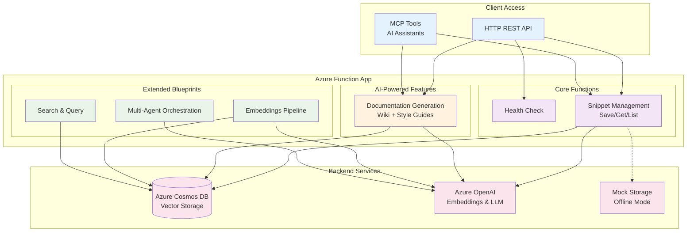

# Technical Description

*(see [README](../README.md) in root for high-level description)*

## Code Structure Overview

All application code is in the `/src`folder.

**[function_app](../src/function_app.py)** is the main Azure Functions application. It provides a dual-interface AI-powered code snippet manager using both HTTP endpoints and MCP (Model Context Protocol) tools for AI assistant integration.

### Core Architecture Components

**Blueprint Registration**: The app uses blueprints to modularize different functional areas. Each blueprint contains azure functions.

**Tool Property System**: Uses a `ToolProperty` class to define standardized input schemas for MCP tools, enabling AI assistants to understand expected parameters. These properties are converted to JSON for MCP tool registration.

### Health & Utility Functions

**`http_health_check`**: Simple endpoint that returns a JSON status response to verify service availability. Includes basic error handling with appropriate HTTP status codes.

### Snippet Management Functions

**`http_save_snippet`**: HTTP endpoint that accepts JSON payloads containing snippet name, code, and optional project ID, then generates embeddings and stores in Cosmos DB. Uses mock storage when `DISABLE_OPENAI` environment variable is set for offline testing.

**`mcp_save_snippet`**: MCP tool version that provides the same functionality as the HTTP endpoint but receives parameters via JSON context from AI assistants. Returns results as JSON strings instead of HTTP responses.

**`http_list_snippets`**: Returns all stored snippets as a JSON array from either Cosmos DB or mock storage. Simple retrieval function with basic error handling.

**`http_get_snippet`**: Retrieves a specific snippet by name from the URL path parameter. Returns 404 if snippet doesn't exist, otherwise returns the full snippet document.

**`mcp_get_snippet`**: MCP tool equivalent that gets snippet name from context arguments instead of URL path. Uses the same retrieval logic as the HTTP version.

### AI-Powered Documentation Functions

**`http_code_style`**: Analyzes saved snippets to generate coding style guides using Azure AI, accepting optional chat history and user queries for context. Returns generated markdown content as JSON response.

**`mcp_code_style`**: MCP tool version that provides identical functionality but receives parameters from AI assistant context. Uses the same AI agent but returns JSON-wrapped results.

**`http_deep_wiki`**: Creates comprehensive wiki documentation by analyzing code snippets with AI, incorporating chat history and user queries for focused content. Returns raw markdown content directly (not JSON-wrapped).

**`mcp_deep_wiki`**: MCP equivalent that generates the same wiki content but receives parameters via context arguments. Uniquely returns raw markdown instead of JSON, unlike other MCP tools.

### Key Design Patterns

The code follows a **dual-interface pattern** where each major function has both HTTP and MCP variants, enabling access from traditional APIs and AI assistants. **Mock storage support** allows offline development and testing when Azure services aren't available.

This structure creates a flexible, AI-integrated code snippet management system that can operate both as a traditional REST API and as a set of tools accessible to AI assistants like GitHub Copilot through the MCP protocol. 

