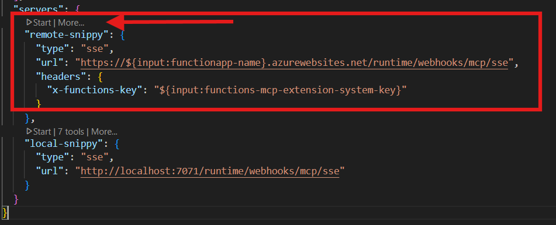
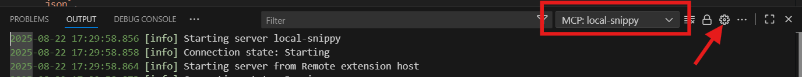
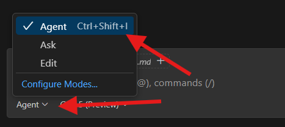

# Level 3.1 — Snippy as an MCP Tool in GitHub Copilot Agent Mode

**🎯 Challenge Points: 10 points (Integration Bonus)**  
*Expose your existing AI + vector capabilities directly to GitHub Copilot via the Model Context Protocol (MCP)*

## 🎓 Learning Objective
Bridge your Azure Functions implementation with AI assistants. Learn how Snippy's snippet storage, vector search, documentation, and style generation are surfaced as first‑class MCP tools that GitHub Copilot (and any MCP‑aware client) can invoke conversationally.

## 📋 What You Just Unlocked
Level 3 introduced vector search + grounded Q&A. Level 3.1 shows how those backend capabilities become interactive tools in Copilot Chat. Instead of writing HTTP calls manually, you (or Copilot) can now say things like:

> “Save this code block as payment_handler in project checkout”  
> “Search snippets for async retry logic”  
> “Generate a style guide”  
> “Create a deep wiki focused on database access patterns”

Copilot automatically discovers the Snippy tool catalog through MCP and sends structured invocations—no custom plugin code required.

## 🧠 Why MCP Integration Matters
- **Native AI Workflow**: Tools appear inline in Copilot Chat; the assistant chooses when to call them.
- **Schema Awareness**: Tool property metadata guides Copilot to supply correct arguments (names, types, descriptions).
- **Single Source of Truth**: Same business logic powers both HTTP endpoints and MCP tools—no code duplication.
- **Rapid Iteration**: Add a new Azure Function + `@generic_trigger(type="mcpToolTrigger")` → instantly available to AI assistants.
- **Security & Governance**: Existing Function auth (keys) + system keys protect your MCP surface.

## 🛠️ MCP Tool Catalog (Snippy)
| Tool | Purpose | Mirrors HTTP Endpoint | Key Inputs |
|------|---------|-----------------------|------------|
| `save_snippet` | Persist code + generate embedding | `POST /api/snippets` | snippetname, snippet, projectid |
| `get_snippet` | Fetch snippet by name | `GET /api/snippets/{name}` | snippetname |
| `search_snippets` | Semantic vector search | (RAG pipeline via `/api/query`) | query, projectid, max_results |
| `list_snippets` | Enumerate stored snippets | `GET /api/snippets` | projectid (optional) |
| `delete_snippet` | (Placeholder) locate + future delete | N/A (not fully implemented) | snippetname, projectid |
| `code_style` | Generate style guide markdown | `POST /api/snippets/code-style` | chathistory, userquery |
| `deep_wiki` | Produce comprehensive wiki | `POST /api/snippets/wiki` | chathistory, userquery |

All seven are registered through strongly‑typed property schemas so Copilot can auto‑fill arguments.

## 🔌 How Registration Works
Each tool uses the Azure Functions Blueprint generic trigger:

```python
@bp.generic_trigger(
		arg_name="context",
		type="mcpToolTrigger",
		toolName="save_snippet",
		description="Saves a given code snippet…",
		toolProperties=tool_properties_save_snippets_json,
)
```

Embedding generation for relevant tools chains via:

```python
@bp.embeddings_input(
		arg_name="embeddings",
		input="{arguments.snippet}",
		input_type="rawText",
		embeddings_model="%EMBEDDING_MODEL_DEPLOYMENT_NAME%"
)
```

This decorator automatically calls Azure OpenAI, injects the embedding, and keeps orchestration logic minimal.

### Tool Property System
`ToolProperty` objects define name, type, description → serialized to JSON → provided to Copilot. This enables:
- Guided parameter completion
- Validation of required vs optional fields
- Consistent UX between HTTP & MCP

## 🧩 Copilot Side: Discovery & Invocation Flow
```
Copilot Session Start → Connect SSE (/runtime/webhooks/mcp/sse)
				 ↓
				Server streams tool schemas
				 ↓
User Prompt (“search for retry logic”) → Copilot plans → Invokes search_snippets
				 ↓
Function executes vector search → returns JSON results
				 ↓
Copilot grounds follow‑up answer using tool output
```

## ⚙️ Configuration (`.vscode/mcp.json`)
```jsonc
{
	"servers": {
		"remote-snippy": {
			"type": "sse",
			"url": "https://${input:functionapp-name}.azurewebsites.net/runtime/webhooks/mcp/sse",
			"headers": { "x-functions-key": "${input:functions-mcp-extension-system-key}" }
		},
		"local-snippy": {
			"type": "sse",
			"url": "http://localhost:7071/runtime/webhooks/mcp/sse"
		}
	}
}
```

This tells github copilot where to look for MCP tools that github copilot can use in agent mode. Try it:

1. Verify MCP Server configuration
    1. open [mcp.json](../.vscode/mcp.json)
    1. see the small Start-button and start it if its not running
    
1. View MCP Server logs
    1. Press Ctrl+Shift+P to open the Command Palette
    1. Type 'MCP: List Servers' and select it
    1. Select the local-snippy server from the dropdown (or remote whichever you are using)
    1. Click 'Show Output' to see the server logs
    1. Tip: Click the settings icon next to "MCP: local-snippy" in the output panel to change log level to "trace" for more detailed logs
    
1. Open GitHub Copilot Chat
1. Configure Copilot Chat for Tools
   - Ensure **Agent mode** is active (select from the dropdown next to the model selector, or *Ctrl+.*)
    
   - At the bottom of the chat panel, click **Select Tools...** (or press Ctrl+Shift+/)
   - Make sure *MCP Server: local-snippy* and all its tools are checked
   - Hit Escape, or Click **OK** to confirm your selection
1. Test the *save_snippet* Tool:
   - Open any code file (e.g., **src/agents/code_style.py**) 
   - Select some interesting code sections (or it'll take the entire file as a snippet, which is okay)
   - In Copilot Chat, type: **save this snippet as ai-agents-service-usage** and click enter or hit Send
   - Copilot will suggest using the **save_snippet** tool - click **Continue**
6. **Test the *get_snippet* Tool**:
   - In Copilot Chat, type: **get the snippet named ai-agents-service-usage** and click enter or hit Send
   - Copilot will suggest using the **get_snippet** tool - click **Continue**
7. Experiment with Advanced AI Agent Tools:
   - Try these prompts (no need to select code first):
     - **generate a deep wiki for all snippets and place in a new file deep-wiki.md in project root** (uses the *deep_wiki* tool)
     - **create a code style guide based on the saved snippets and place in a new file code-style.md in project root** (uses the *code_style* tool)
   - These agent-based tools may take 15-30 seconds to run as they orchestrate (via managed AI Agents service) with configured tools and have self-reflection
   - Once they are done, open the files and Preview the generated Markdown (*Ctrl+K V*)
8. **Check Function Logs**:
    - functions running locally:
        - In the terminal where `func start` is running, you'll see logs for each tool invocation
        - This confirms your MCP tools are working end-to-end
    - go to application insights and check the traces table

### Selecting Environment
- Use `local-snippy` during `func start` development.
- Switch to `remote-snippy` for deployed testing; supply system key (preferred over per‑function keys for MCP).

## 🔐 Authentication Model
| Path | Purpose | Auth |
|------|---------|------|
| `/api/*` | Classic HTTP endpoints | Function key (or other configured auth) |
| `/runtime/webhooks/mcp/sse` | MCP tool discovery + streaming | System key / function key |

System keys can be rotated independently. Copilot includes the key in the `x-functions-key` header per `.vscode/mcp.json`.

## 🔄 Dual Interface Pattern
Same storage + embedding logic is consumed by both surfaces:
- HTTP path returns `HttpResponse`
- MCP path returns raw JSON (or markdown for `deep_wiki`)

This keeps business logic testable and avoids divergence.

## 🗣️ Example Copilot Chat Prompts
| Prompt | Expected Tool | Copilot Behavior |
|--------|---------------|------------------|
| “Store this snippet as http_utils in project core” | save_snippet | Extracts code block, sends name + projectId + snippet |
| “List snippets for project core” | list_snippets | Adds project filter if you supplied it in prior turns |
| “Search for JWT validation logic” | search_snippets | Supplies query, uses default project if not specified |
| “Show snippet payment_handler” | get_snippet | Returns snippet JSON, Copilot may inline code |
| “Generate a style guide for our patterns” | code_style | Optionally includes prior chat as chathistory |
| “Create a wiki focusing on API security” | deep_wiki | Returns markdown ready to persist |

## 🧮 Response Shapes (Representative)
```jsonc
// search_snippets
{
	"query": "retry logic",
	"results_count": 2,
	"snippets": [
		{ "name": "retry_helper", "score": 0.12, "code_preview": "async def with_retry..." }
	]
}

// save_snippet
{
	"id": "retry_helper",
	"name": "retry_helper",
	"projectId": "core",
	"status": "upserted"
}
```

`deep_wiki` returns raw markdown (not JSON) so Copilot can immediately display formatted sections.

## 🛡️ Guardrails & Safety
- Tool inputs constrained by property schemas.
- Embedding generation restricted to supplied snippet text (no arbitrary remote fetch).
- Auth key required for all MCP access.
- Placeholder delete prevents accidental destructive operations until fully implemented.

## 🚀 Extending the Catalog
Add a new function:
1. Implement HTTP version (optional but recommended)
2. Add business logic (shared module)
3. Define `ToolProperty` list + JSON dump
4. Decorate with `@bp.generic_trigger(type="mcpToolTrigger", ...)`
5. (Optional) Chain embeddings with `@bp.embeddings_input`
6. Redeploy → Copilot auto‑discovers it on next session start

## ✅ Acceptance Criteria
Complete when you can:
- ✅ See Snippy tools listed in Copilot Chat (Agent mode) under available actions
- ✅ Invoke `save_snippet` from natural language and confirm Cosmos persistence
- ✅ Run semantic search (`search_snippets`) and receive relevant results
- ✅ Generate style guide + wiki with contextual prompts
- ✅ Observe matching behavior between MCP tools and HTTP endpoints
- ✅ Rotate the system key and reconnect successfully
- ✅ Add (or simulate) a new tool and have it appear without UI changes

## 💡 Pro Tips
- Provide explicit names in prompts to reduce LLM ambiguity (e.g., “Store as retry_helper”).
- Use follow‑up prompts—Copilot will reuse earlier argument values (e.g., projectId) where appropriate.
- If a tool errors, ask Copilot to “show raw tool invocation” to debug arguments.
- Keep descriptions in `ToolProperty` concise but action‑oriented; this directly affects Copilot’s plan quality.

## 🧭 Where This Leads
Next levels build on MCP exposure to enable multi‑agent tool orchestration (Level 5) and Zero Trust policies (Level 6) enforced at the tool boundary.

---

## 🎯 Summary
You’ve turned Snippy into a first‑class AI tool suite. By layering MCP onto existing Azure Functions you unlocked conversational, schema‑aware access for GitHub Copilot—without rewriting core logic. This is the pattern for rapidly productizing internal APIs as AI‑consumable capabilities.

**Ready for Level 4?** You'll operationalize ingestion & observability while keeping MCP tools instantly in sync.

